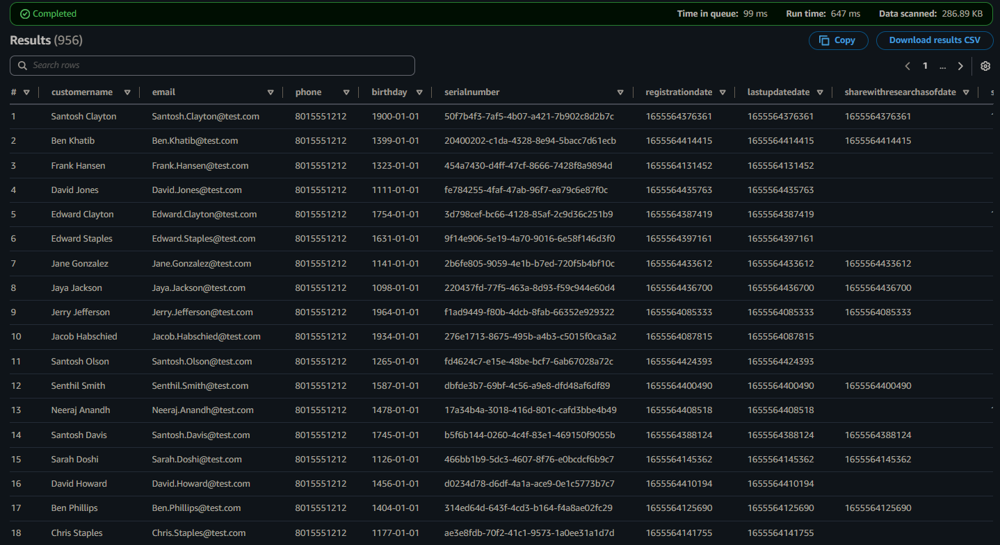
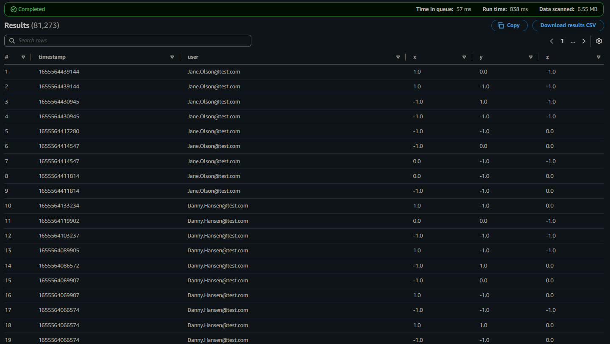
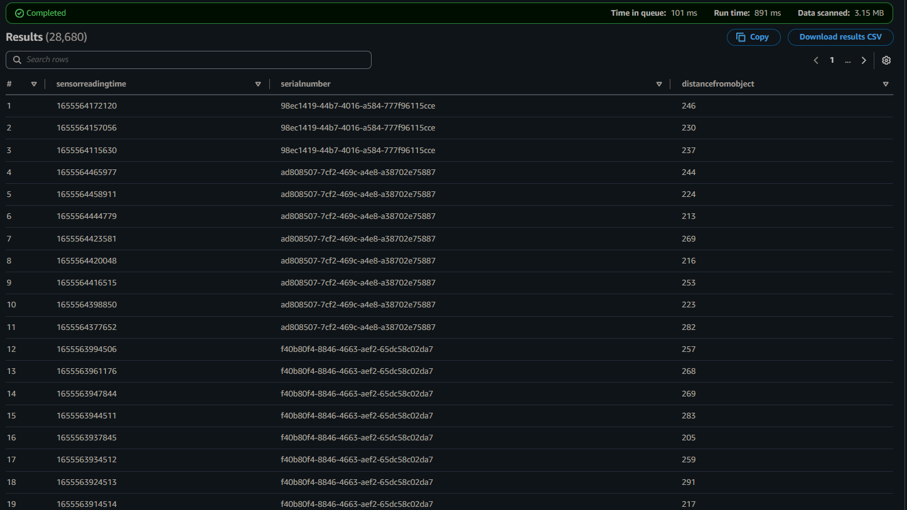
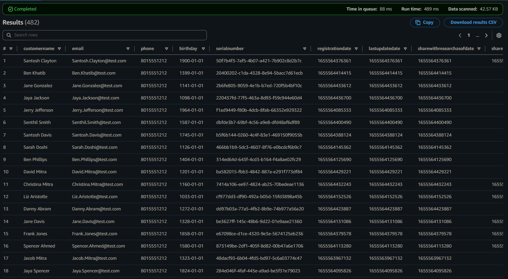
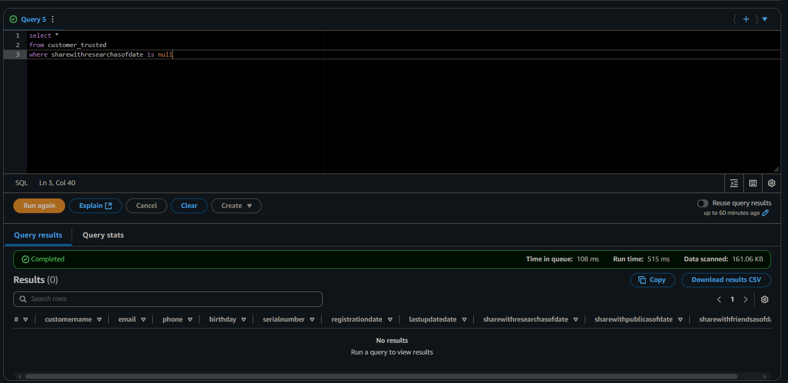
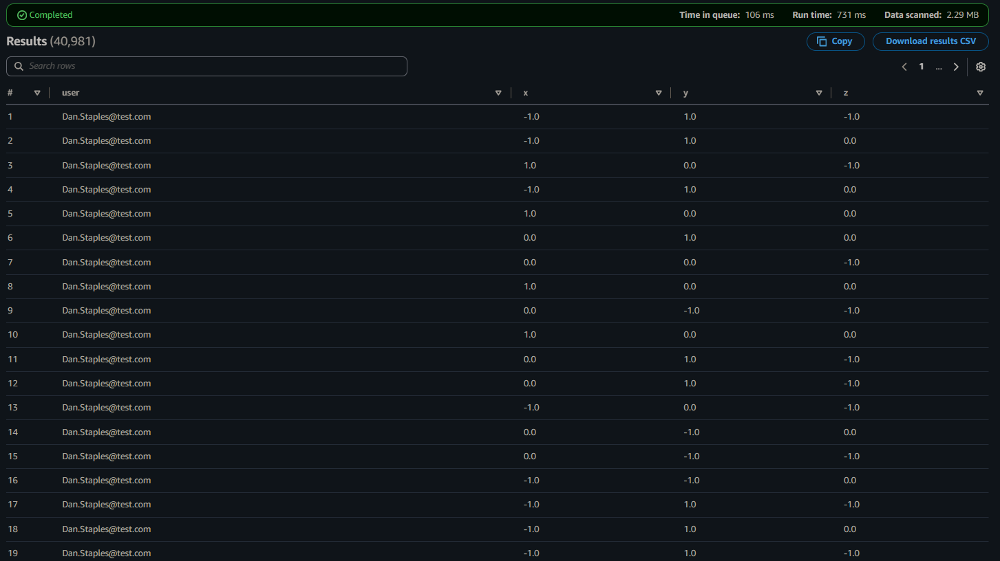
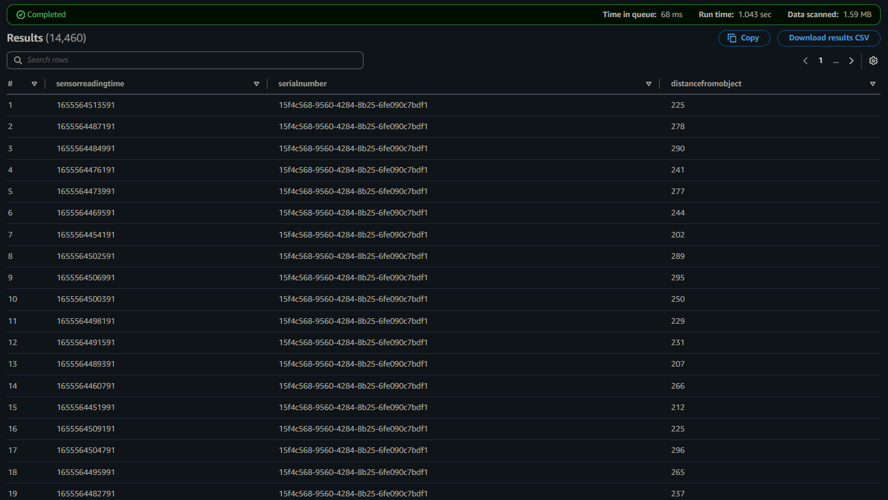
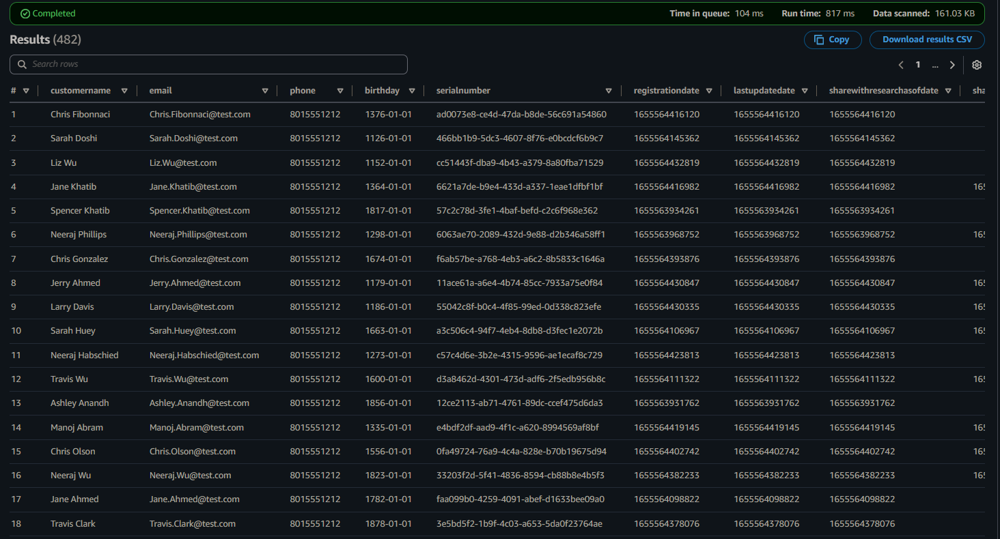
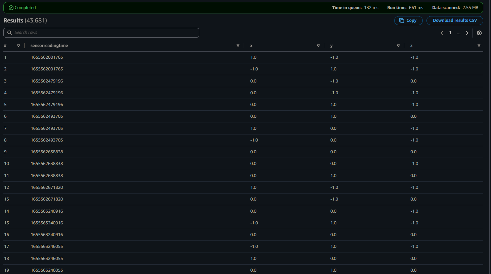

# STEDI-Human-Balance-Analytics

## Project Details

The STEDI Team has been hard at work developing a hardware STEDI Step Trainer that:

- trains the user to do a STEDI balance exercise;
- has sensors on the device that collect data to train a machine-learning algorithm to detect steps;
- has a companion mobile app that collects customer data and interacts with the device sensors.

STEDI has heard from millions of early adopters who are willing to purchase the STEDI Step Trainers and use them.

Several customers have already received their Step Trainers, installed the mobile application, and begun using them together to test their balance. The Step Trainer is just a motion sensor that records the distance of the object detected. The app uses a mobile phone accelerometer to detect motion in the X, Y, and Z directions.

The STEDI team wants to use the motion sensor data to train a machine learning model to detect steps accurately in real-time. Privacy will be a primary consideration in deciding what data can be used.

Some of the early adopters have agreed to share their data for research purposes. Only these customers’ Step Trainer and accelerometer data should be used in the training data for the machine learning model.

## Project Datasets

### **1. Customer Records**
This is the data from fulfillment and the STEDI website. The data contains the following fields:
- serialnumber
- sharewithpublicasofdate
- birthday
- registrationdate
- sharewithresearchasofdate
- customername
- email
- lastupdatedate
- phone
- sharewithfriendsasofdate

### **2. Step Trainer Records**
This is the data from the motion sensor. The data contains the following fields:
- sensorReadingTime
- serialNumber
- distanceFromObject

### **3. Accelerometer Records**
This is the data from the mobile app. The data contains the following fields:
- timeStamp
- user
- x
- y
- z

## Project Environment

The data from the STEDI Step Trainer and mobile app to develop a lakehouse solution in the cloud that curates the data for the machine learning model using:
- Python and Spark
- AWS Glue
- AWS Athena
- AWS S3

## Implementation

The data is then transitioned through 3 different zones for processing. 
- Landing Zone: This zone includes raw data for customer, accelerometer and step trainer.
- Trusted Zone: This zone includes data only for customers that have agreed to share their data for research purposes. 
- Curated Zone: This zone includes customers who have accelerometer data and have agreed to share their data for research.

### Landing Zone 

An S3 bucket is created to store the data coming from various sources. The three datasets for the project are ingested into their respective directories in the S3 bucket. 
The following landing tables are created using AWS Glue for the three datasets.

1. Customer Landing Table:

2. Accelerometer Landing Table:

3. Step Trainer Landing Table:

Here are the DDL scripts for creation of these tables: 
- [customer_landing.sql](ddl/customer_landing.sql)
- [accelerometer_landing.sql](ddl/accelerometer_landing.sql) 
- [step_trainer_landing.sql](ddl/step_trainer_landing.sql)

### Trusted Zone

Following the Data Science teams preliminary data analysis, the following two glue tables are created.

1. Customer Trusted: Includes only the Customer Records who agreed to share their data for research purposes.

the below screenshot the resulting customer trusted data that has no rows where shareWithResearchAsOfDate is blank.

2. Accelerometer Trusted: Includes Accelerometer Readings from customers who agreed to share their data for research purposes.

3. Step Trainer Trusted: Contains the Step Trainer Records data for customers who have accelerometer data and have agreed to share their data for research.

Here are the AWS Glue Job Scripts:
- [customer_landing_to_trusted.py](aws_glue_spark_jobs/customer_landing_to_trusted.py)
- [accelerometer_landing_to_trusted.py](aws_glue_spark_jobs/accelerometer_landing_to_trusted.py)
- [step_trainer_landing_to_trusted.py](aws_glue_spark_jobs/step_trainer_landing_to_trusted.py)

### Curated Zone

Data Scientists have discovered a data quality issue with the Customer Data. The serial number should be a unique identifier for the STEDI Step Trainer they purchased. However, there was a defect in the fulfillment website, and it used the same 30 serial numbers over and over again for millions of customers! Most customers have not received their Step Trainers yet, but those who have, are submitting Step Trainer data over the IoT network (Landing Zone). The data from the Step Trainer Records has the correct serial numbers.

The problem is that because of this serial number bug in the fulfillment data (Landing Zone), we don’t know which customer the Step Trainer Records data belongs to.

Following Curated Tables are created using AWS Glue:
1. Customer Curated: Only includes customers who have accelerometer data and have agreed to share their data for research.

2. Machine Learning Curated: An aggregated table that has each of the Step Trainer Readings, and the associated accelerometer reading data for the same timestamp, but only for customers who have agreed to share their data.

Here are the AWS Glue Job Scripts:
- [customer_curated.py](aws_glue_spark_jobs/customer_curated.py)
- [machine_learning_curated.py](aws_glue_spark_jobs/machine_learning_curated.py)